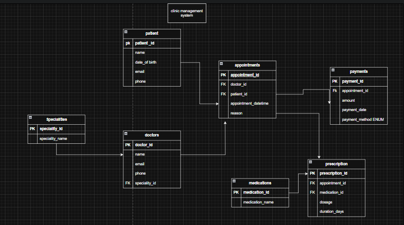

# 🏥 Clinic Management System - SQL Database

This project provides a fully functional **SQL-based database schema** designed for a clinic management system. It includes tables and sample data to manage doctors, patients, appointments, payments, prescriptions, and medications.

## ✅ Features

- Specialties and doctor assignments  
- Patient records with contact details  
- Appointment scheduling with time conflict prevention  
- Payment tracking per appointment  
- Medication catalog  
- Prescription linking medications to specific appointments  

## 🧪 Sample Data

The script includes sample entries for:
- 4 Specialties  
- 3 Doctors  
- 2 Patients  
- 2 Appointments  
- 2 Payments  
- 3 Medications  
- 3 Prescriptions  

This allows immediate testing and development without requiring manual data entry.

## 📌 Usage Notes

- Appointments are uniquely tied to a doctor’s schedule (no overlapping).
- Each appointment has at most one payment.
- Multiple medications can be prescribed during an appointment.
- Extendable design—new entities (e.g., medical tests or staff) can be added as needed.

---

## 📧 Contact

For feedback or questions, feel free to reach out via email or contribute to the project repository.